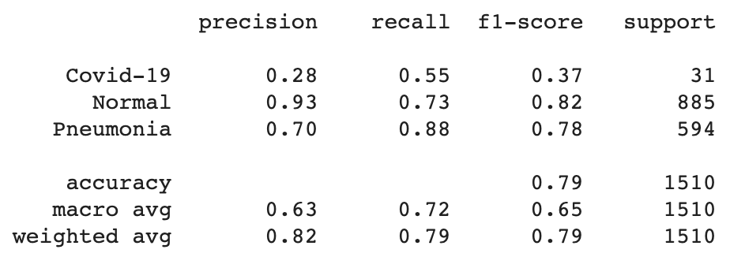
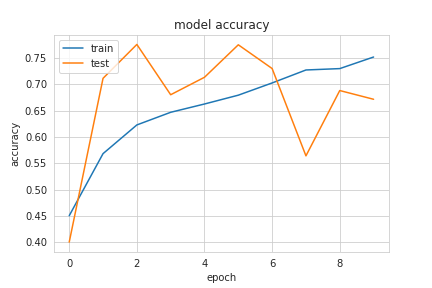
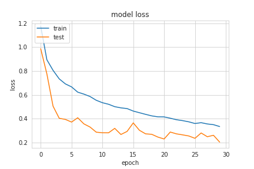

# Model and Hyper-parameters

Link to access the four models weights: https://drive.google.com/drive/folders/1-9k7zI7oOh3KLzgv7Ee7QsyAnkmgHsnV?usp=sharing

<!-- First Model -->
## BraDetect 1

The BraDetect was designed with the objective of being specially efficient at analyzing chest x-rays. As such, the architecture is composed of the following:
    
    - Conv 3x3 , 16 
    - Conv 3x3 , 16 
    - MaxPooling2D

    - Conv 3x3 , 32
    - Conv 3x3 , 32
    - MaxPooling2D

    - Conv 3x3 , 64
    - Conv 3x3 , 64
    - MaxPooling2D

    - Conv 3x3 , 96
    - Conv 3x3 , 96
    - MaxPooling2D

    - Conv 3x3 , 128
    - Conv 3x3 , 128
    - MaxPooling2D

    - Flatten
    - Dense with nodes 1024
    - Dropout of 0.5
    - Dense with nodes 3 

### Results
#### Training

#### Classification Report

#### Confusion Matrix

<!-- Second Model -->

__________________________________
## BraDetect 2

Here we tried another setting of this network:
    
    - Conv 3x3 , 32
    - Conv 3x3 , 32
    - MaxPooling2D
    - Dropout of 0.2

    - Conv 3x3 , 64
    - Conv 3x3 , 64
    - MaxPooling2D
    - Dropout of 0.2

    - Conv 3x3 , 128
    - Conv 3x3 , 128
    - MaxPooling2D
    - Dropout of 0.2    

    - Flatten
    - Dense with nodes 128
    - Dropout of 0.2
    - Dense with nodes 3 

Learning Rate of 0.0001 using Adam, with decaying callback on keras.

### Results
#### Training

#### Classification Report

#### Confusion Matrix

<!-- Third Model -->

__________________________
## BraDetect 3

Here we tried yet another approach for this network:

    - Conv 3x3 , 64
    - MaxPooling2D
    - BatchNormalization
    - ZeroPadding

    - Conv 3x3 , 96
    - MaxPooling2D
    - BatchNormalization
    - ZeroPadding

    - Conv 3x3 , 128
    - MaxPooling2D
    - BatchNormalization
    - ZeroPadding

    - Flatten
    - Dense with nodes 256
    - Dropout of 0.5
    - Dense with nodes 256
    - Dropout of 0.5
    - Dense with nodes 3 

Learning Rate of 0.0001 using Adam, with decaying callback on keras.

### Results
#### Training

#### Classification Report

#### Confusion Matrix

## BraDetect 4

This is the third architecture with twice the epochs.

### Results
#### Training

#### Classification Report

#### Confusion Matrix

# Conclusion

Training the BraDetect architecture proved to wield decent results, being the third attempt with increase number of epochs the best performance. Like all others, this one learned quite well all the classes with exception of the __COVID-19__, which was slighty worst. 