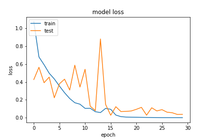
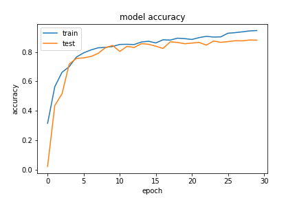
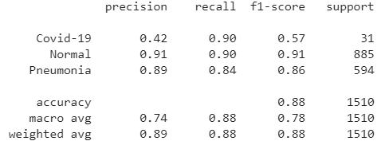

# Model and Hyper-parameters

The CXRP- *x*B model - Covid X-ray Profiler with __x__ blocks - was designed with the objective of being specially efficient at analyzing chest x-rays. As such, the architecture is composed of the following:

The number of blocks needed was found through experiments, being 3 blocks the final amount.

Various versions of this architecture were studied, which we show along this document.

Another important aspect of this model is that every execution of the training was made with different weights on the 3 classes, having __COVID-19__ 3x the normal weight of the other two classes. We found this way the model reached better results in less time, learning better the COVID-19 patterns, which was always the worst performing class on all the other models used.

<!-- First Model -->

## First iteration of the CXRP, CXRP-1B
    
    - 1 Block
    - Adam optimizer with learning rate 0.001

Link to access the model weights: https://drive.google.com/drive/folders/1-U4gLUbzta6MbzTPt65MKoLa0OzkRcl4?usp=sharing

### Results

#### Classification Report

#### Confusion Matrix

<!-- Second Model -->

## Second iteration of the CXRP, CXRP-2B
    
    - 2 Blocks
    - Adam optimizer with learning rate 0.001

Link to access the model weights: https://drive.google.com/drive/folders/1-wAjRyv6ynX3gaWbeKDh-8-pjjJCJlEG?usp=sharing

### Results

#### Classification Report

#### Confusion Matrix

<!-- Thrid Model -->

## Thrid iteration of the CXRP, CXRP-3B
    
    - 3 Blocks
    - Adam optimizer with learning rate 0.001

Link to access the model weights: https://drive.google.com/drive/folders/10AmCEvtAPPwVnnVb2-4R44B_hly5IXDk?usp=sharing

### Results

#### Classification Report

#### Confusion Matrix

# Conclusion

As said earlier, 3 blocks was the best performing setting for this model, as well as the 256-128-3 fully connected layers at the end of the model. Different combinations were tried (more on that on the *.ipynb* ) but the performance were in some cases slighty worse or even non-usuable on others. This combinations ranged from different kernel sizes, to different versions of the blocks, as well as different fully connected layers on the output of the model. Our objective with this model was to try maximize the *recall* on the __Covid-19__ class, without worsening the others, which we thought was well executed. 

To test this model, simply run this [notebook](Query_CXRP-3B.ipynb).