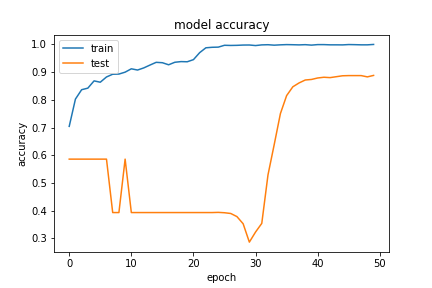
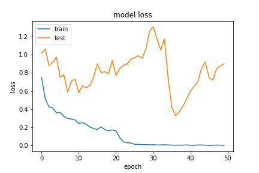
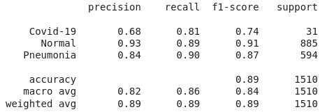
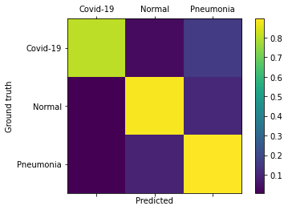
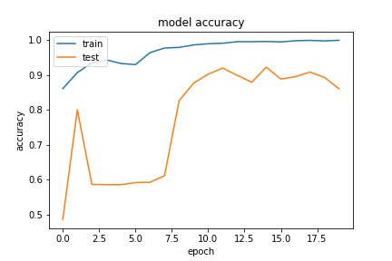
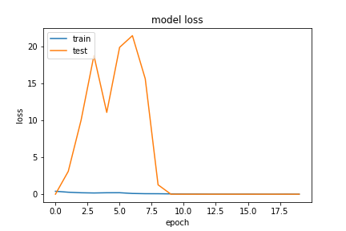
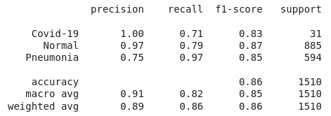
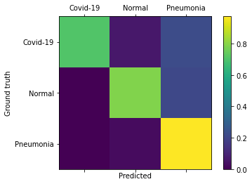

# Model and Hyper-parameters

<!-- First Model -->

## Training from scratch base model with balanced dataset

Standard base MobileNetV2 trained from scratch with a modification on the output layers:
    
    - GlobalAveragePooling2D
    - Dense of 1024 nodes, using relu
    - Dropout of 0.3
    - Dense of 256 nodes, using relu
    - Dense of 3 nodes, using softmax

Learning Rate of 0.001 using Adam, with decaying callback on keras.

Link to access the model weights: https://drive.google.com/drive/folders/10WcXrJNS-cbMZeYOGsMx-c73G8zU19Mo?usp=sharing

### Results

#### Classification Report

#### Confusion Matrix

<!-- Second Model -->

## Importing base model for retraining with balanced dataset

Standard base MobileNetV2 retrained with a modification on the output layers:
    
    - GlobalAveragePooling2D
    - Dense of 1024 nodes, using relu
    - Dropout of 0.3
    - Dense of 256 nodes, using relu
    - Dense of 3 nodes, using softmax

Learning Rate of 0.001 using Adam, with decaying callback on keras.

Link to access the model weights: https://drive.google.com/drive/folders/101AhrYOK7n28fMJhJXmOgoOv7IL3Pv2V?usp=sharing

### Results

#### Classification Report

#### Confusion Matrix

# Conclusion
Training from scratch the MobileNetV2 proved to wield better results than using the already trained weights, and, even tho it had a very rough train on the first half of the training, it managed to learn enough to predict __COVID-19 with 81% Sensivity__. The smaller dimension of this architecture certainly helps make better results compared to for example *VGG16 and VGG19*, which lead us to believe we can probably make from scratch models of small dimension that will give us equal or better performance.