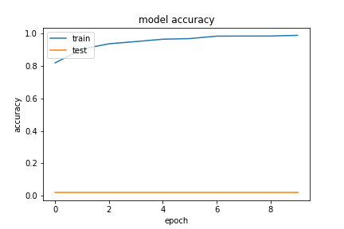
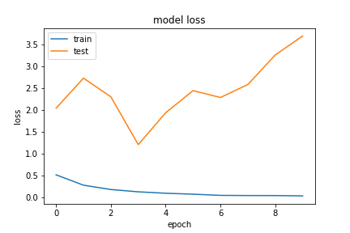
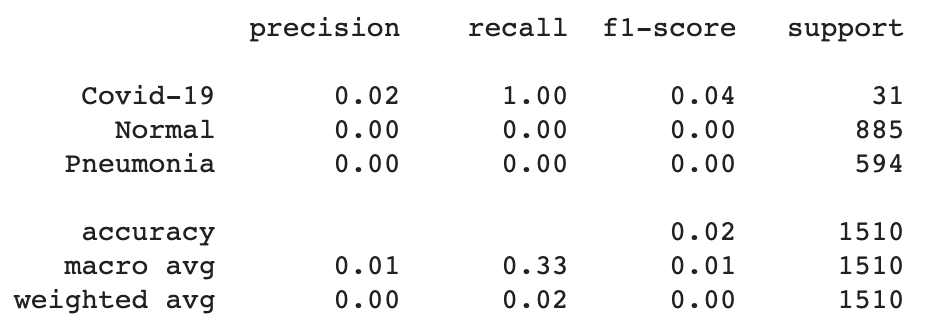
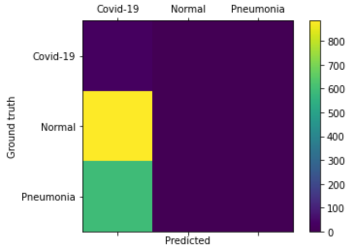
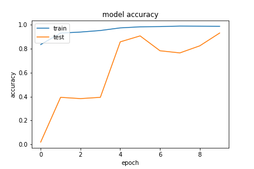
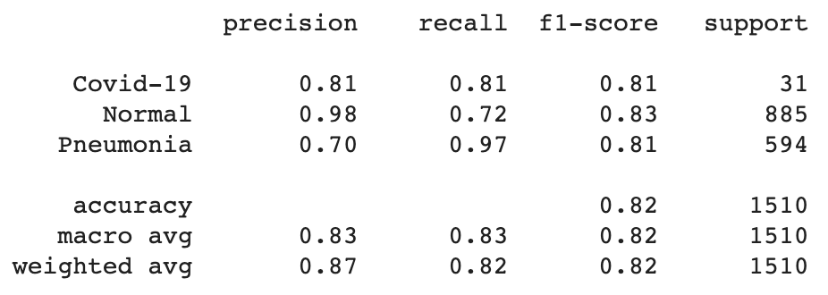
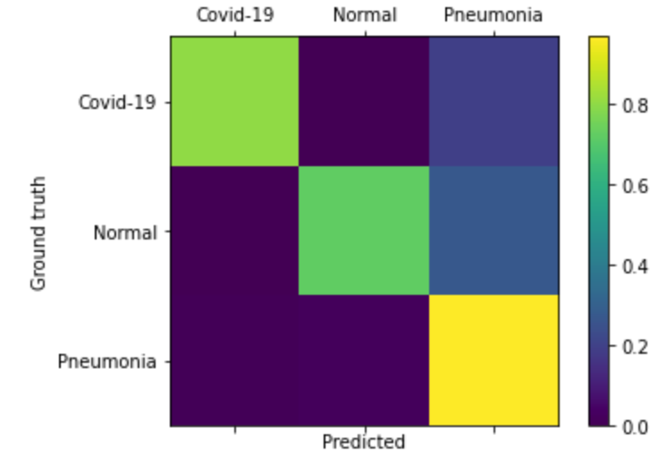

# Model and Hyper-parameters
Link to access the models weights: https://drive.google.com/drive/folders/1-G_RMiavFqebwgmJxSrFXQu-GdzEQFFa?usp=sharing

# ResNet50 1

Standard ResNet freezed with the following added:
    
    - Dense of 128 nodes, using relu
    - Dropout of 0.2
    - Dense of 64 nodes, using relu
    - Dropout of 0.2
    - Dense of 3 nodes, using softmax

Learning Rate of 0.0001 using Adam, with decaying callback on keras.

### Results

### Confusion Matrix

### Classification Report

# ResNet50 2

This model was retrained with the imagenet weights and the three last layers equal to ResNet50 1.

### Results

### Confusion Matrix

### Classification Report

# Conclusion

The frozen ResNet architecture had a horrible performance for this case. For the ResNet50 1 we tried many iterations, but the results were the same: training from scratch resulted in a bad training. On the other hand, retraining using the already trained weights handled better results, but still overall worse than the other models explored.
