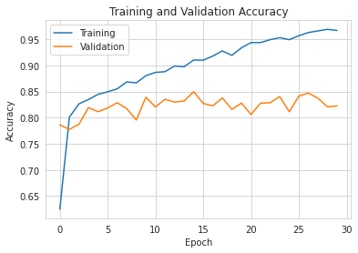
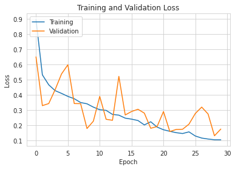
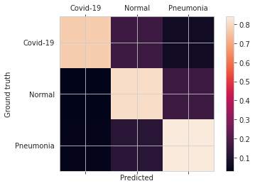
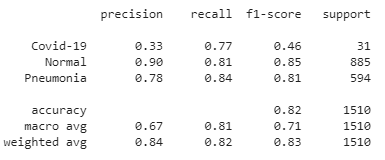
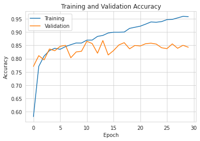
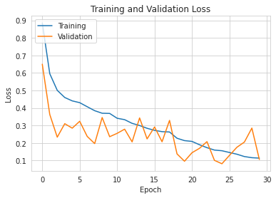
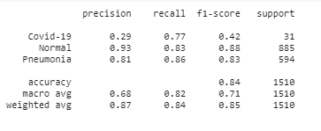
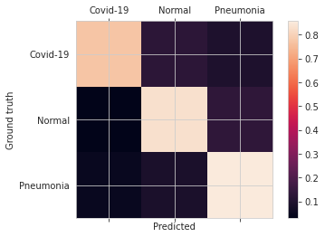

# Model and Hyper-parameters

The SCNN- *x*Block model - Simple Covid Neural Network with __x__ blocks - was designed with the objective of being simple and efficient at analyzing chest x-rays. 
The architecture is composed of the following:

## SCNN Model with balanced dataset, SCNN-1Block
    
   
### Results

#### Confusion Matrix

#### Classification Report
 
    

Link to access the model weights: https://drive.google.com/drive/folders/1-G6dT_a3ZxD6INWP_PAIcCN5sBH-Yjcn?usp=sharing

## SCNN Model with balanced dataset, SCNN-2Block

### Results

#### Confusion Matrix

#### Classification Report

# Conclusion
Esta arquitetura é uma arquitetura bastante simples. Esperava-se que os resultados melhorassem no aumento da quantidade de blocos, mas verificou-se que os resultados eram praticamente os mesmos.Chegou a um dado numero de blocos, em que os resultados pioraram devido talvez à complexidade do modelo. 
Os resultados finais foram muito identicos a resultados obtidos em modelos já experimentados anteriormente. Talvez com uma melhoria no dataset, se obtinha melhores resultados.

