# Model and Hyper-parameters

<!-- First Model -->

## Importing pre-trained model with standard *dataset*
Standard VGG16 freezed with the following added:
    
    - Dense of 512 nodes, using relu
    - Dropout of 0.5
    - Dense of 256 nodes, using relu
    - Dense of 3 nodes, using softmax

Learning Rate of 0.001 using Adam, with decaying callback on keras.

Link to access the model weights: https://drive.google.com/drive/folders/1-4MAlVo15gQ2NsU6DbHAKwqRSdROk6hK?usp=sharing

### Results

#### Classification Report
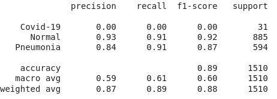

#### Confusion Matrix
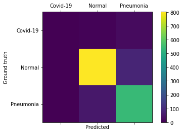

<!-- Second Model -->

__________________________________

## Importing pre-trained model with balanced *dataset*
Standard VGG16 freezed with the following added:
    
    - Dense of 512 nodes, using relu
    - Dense of 3 nodes, using softmax

Learning Rate of 0.0001 using Adam, with decaying callback on keras.

Link to access the model weights: https://drive.google.com/drive/folders/1-3CbhseqNYk-pg2FeSKJp-JBZIp_vAsa?usp=sharing

### Results

#### Training
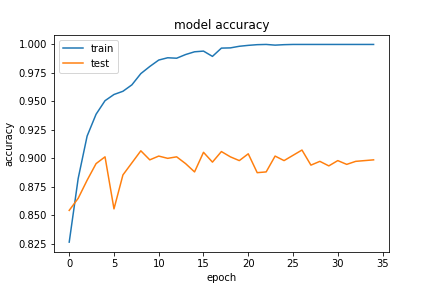
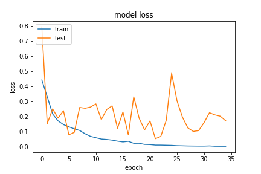

#### Classification Report
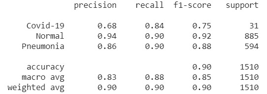

#### Confusion Matrix

<!-- Third Model -->

__________________________

## Retraining pre-trained model with balanced *dataset*
Standard VGG16 with the following added:
    
    - Dense of 512 nodes, using relu
    - Dense of 3 nodes, using softmax

Learning Rate of 0.0001 using Adam, with decaying callback on keras.

Link to access the model weights: https://drive.google.com/drive/folders/1C6r2tBEIAO8A04ilf4iL2FlsKw_wyqsu?usp=sharing
### Results

#### Training
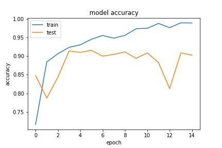
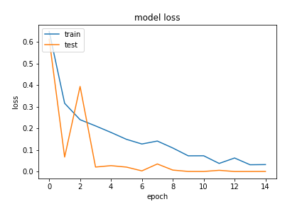

#### Classification Report
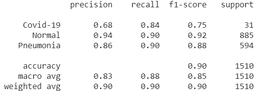

#### Confusion Matrix
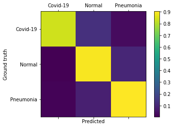

<!-- Fourth Model -->

_________________________

## Training from *scratch* the VGG16 architecture with the balanced *dataset*
Standard VGG16 with the following added:
    
    - Dense of 512 nodes, using relu
    - Dense of 3 nodes, using softmax

Learning Rate of 0.0001 using Adam, with decaying callback on keras.

Link to access the model weights: https://drive.google.com/drive/folders/1-MIoGgn2CsW7fVwbsxckTncmXarkeK_E?usp=sharing
### Results

#### Training
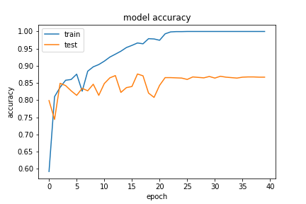
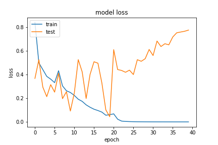

#### Classification Report
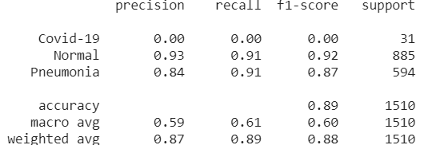

#### Confusion Matrix
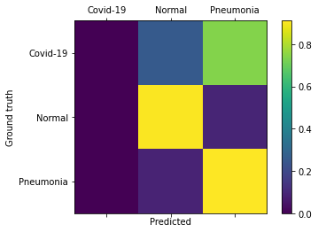

# Conclusion

Training from scratch the VGG16 architecture proved to not wield good results, even tho on the similar VGG19 architecture appeared to have reasonable success (compared to this one). If we were to run it again it could maybe give similar results to the VGG19, but it would still be bad compared to retraining it with the existing trained weights. As such, the 84% recall achieved on detecting COVID-19 and 90% on the remaining cases were, so far, the best we have got. 