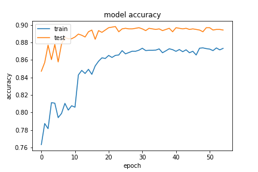
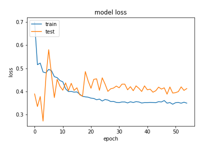
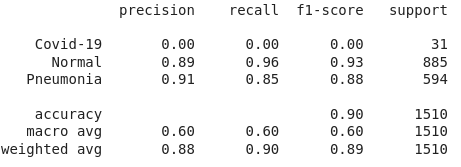
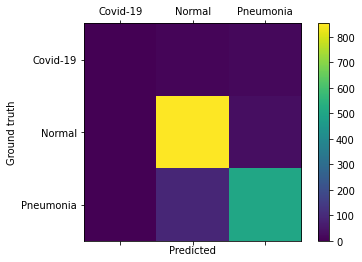

# Model and Hyper-parameters

Standard VGG19 freezed with the following added:
    
    - Dense of 512 nodes, using relu
    - Dropout of 0.5
    - Dense of 256 nodes, using relu
    - Dense of 3 nodes, using softmax

Learning Rate of 0.001 using Adam, with decaying callback on keras.

Link to access the model weights: https://drive.google.com/open?id=1-QBoxxij7FKnr_TzGAk2Kg38e7pp4OWq

# Results

## Confusion Matrix

## Classification Report

