# Model and Hyper-parameters

<!-- First Model -->

## Importing pre-trained model with standard dataset

Standard VGG19 freezed with the following added:
    
    - Dense of 512 nodes, using relu
    - Dropout of 0.5
    - Dense of 256 nodes, using relu
    - Dense of 3 nodes, using softmax

Learning Rate of 0.001 using Adam, with decaying callback on keras.

Link to access the model weights: https://drive.google.com/open?id=1-QBoxxij7FKnr_TzGAk2Kg38e7pp4OWq

### Results

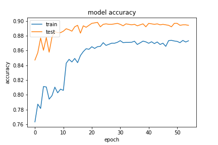

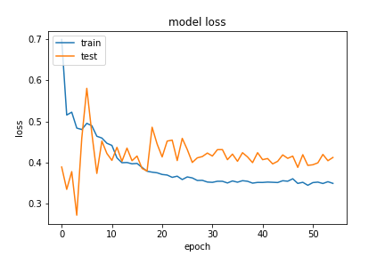

#### Classification Report

#### Confusion Matrix

<!-- Second Model -->

## Importing pre-trained model with balanced dataset

Standard VGG19 freezed with the following added:
    
    - Dense of 512 nodes, using relu
    - Dense of 3 nodes, using softmax

Learning Rate of 0.0001 using Adam, with decaying callback on keras.

Link to access the model weights: https://drive.google.com/drive/folders/1-G6dT_a3ZxD6INWP_PAIcCN5sBH-Yjcn?usp=sharing

### Results

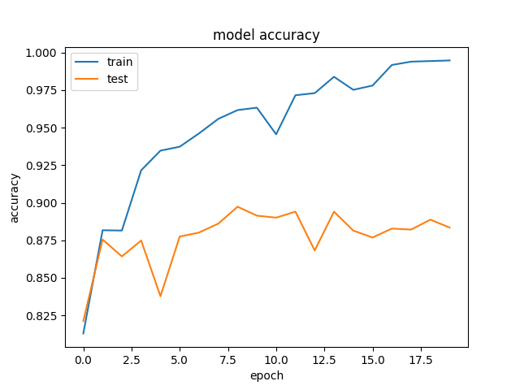

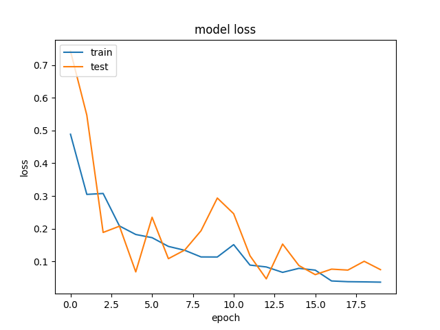

#### Classification Report
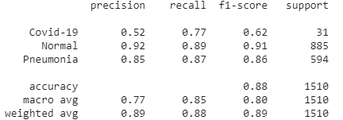

#### Confusion Matrix
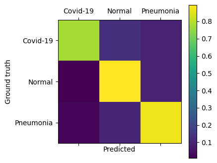

The increase of complexity after the vgg19 model didn't increase it's performance, so we decided to keep it simple (as it was demonstrated here).

<!-- Third Model -->

## Retrain pre-trained model with balanced dataset

Standard VGG19, already trained, with the following added:
    
    - Dense of 512 nodes, using relu
    - Dense of 3 nodes, using softmax

Learning Rate of 0.0001 using Adam, with decaying callback on keras.

Link to access the model weights: https://drive.google.com/drive/folders/10KMKurEci8p-lZNhp2LDdVcZNEXmthN2?usp=sharing

### Results

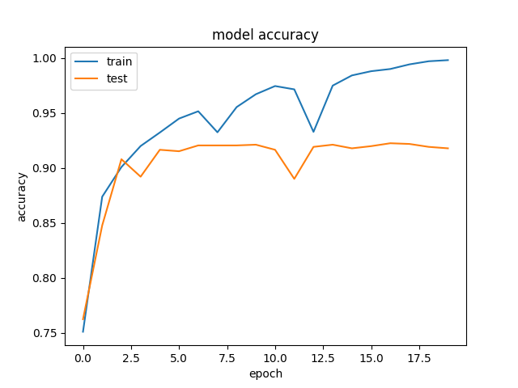

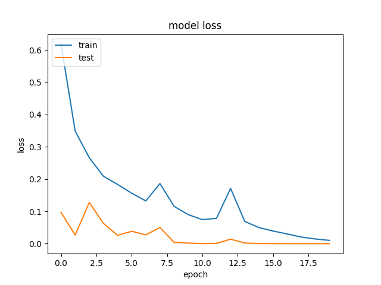

#### Classification Report
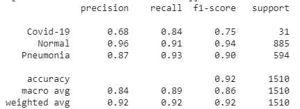

#### Confusion Matrix
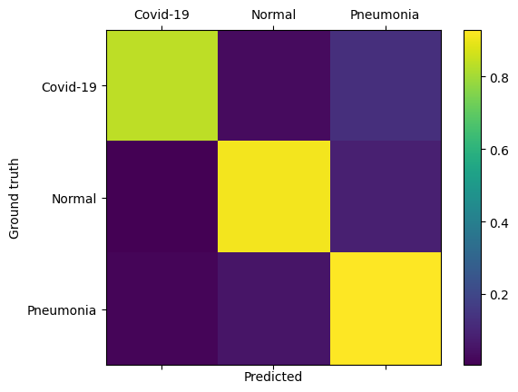

<!-- Fourth Model -->

## Retrain pre-trained model from scratch with balanced dataset

Standard base VGG19 architecture, with the following added:
    
    - Dense of 512 nodes, using relu
    - Dense of 3 nodes, using softmax

Learning Rate of 0.0001 using Adam, with decaying callback on keras.

Link to access the model weights: https://drive.google.com/drive/folders/10nay_IlsWsFNFbJef1Hz1-Gbj63LDJ8g?usp=sharing

### Results

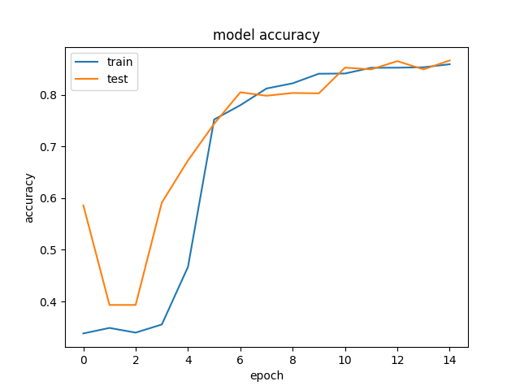

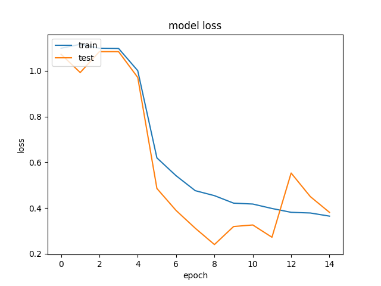

#### Classification Report
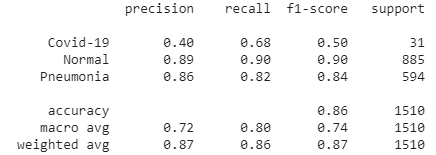

#### Confusion Matrix
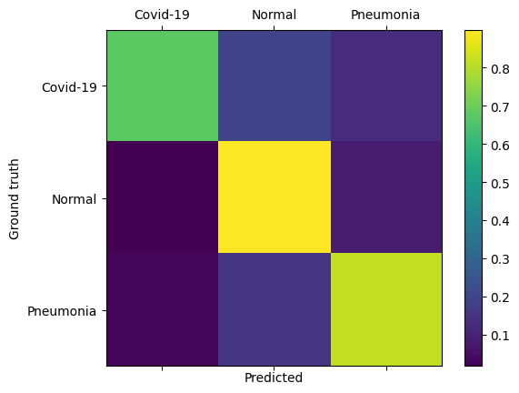

# Conclusion

The increase of epochs and the change of learning rate or complexity of the final end of the model proved to perform equal or worst in training than the current setup.
It appears that, like the __VGG16__ and others, the model still lacks enough data to fully understand the COVID-19 cases, leading the model to eventually overfit on the training data, leading to bad results. Even so, before the model enters in overfit, we managed to score a recall (aka *Sensitivity*) of around 68% on the COVID-19 cases and above 85% for the others.