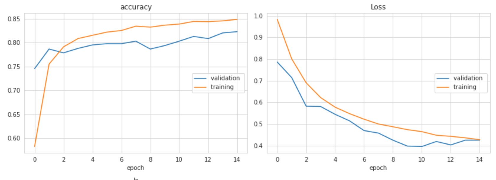
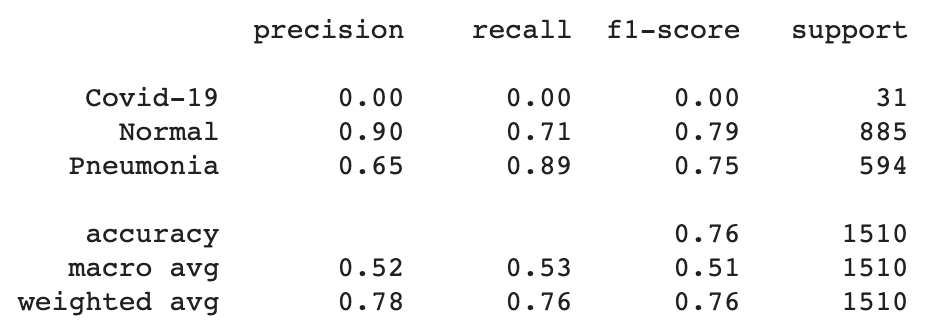
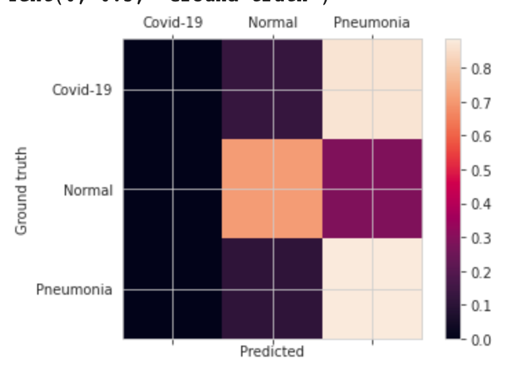
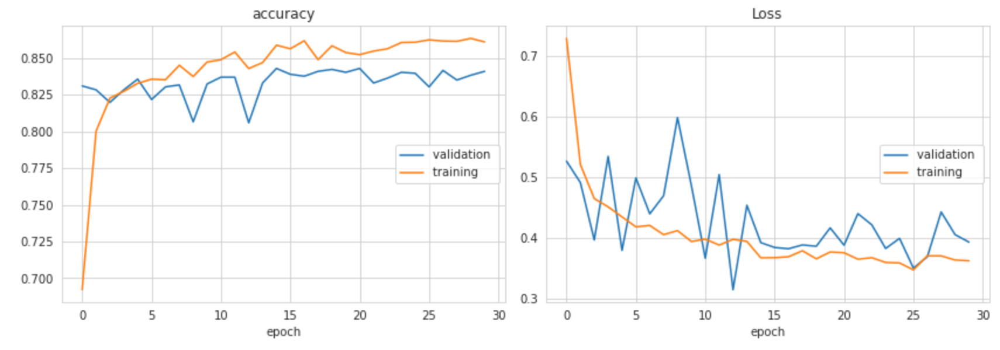
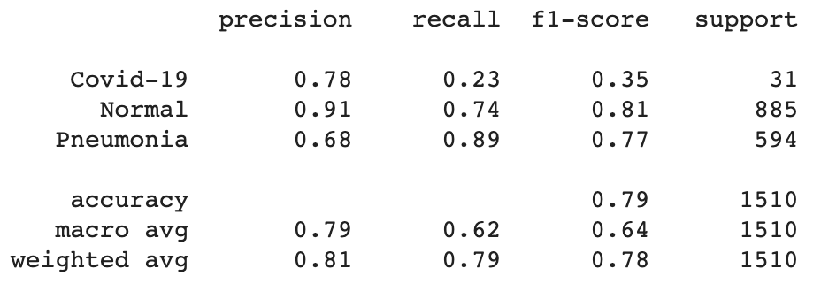
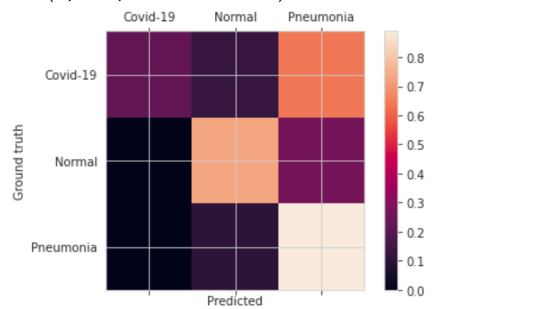
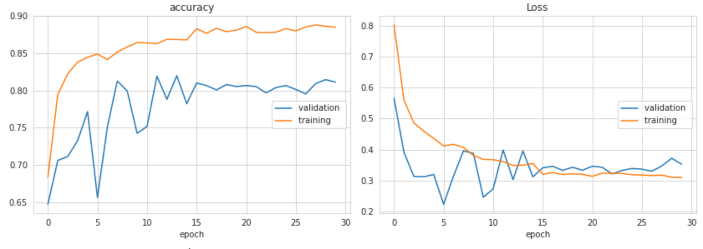
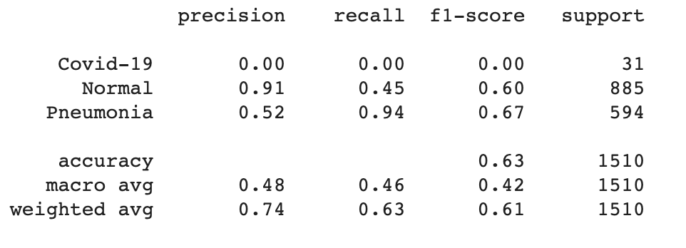
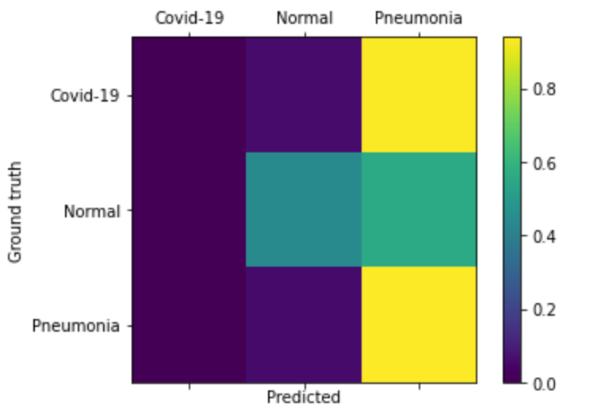

# Model and Hyper-parameters

## Importing pre-trained model with standard *dataset*
Link to access the three models weights: https://drive.google.com/drive/folders/1thjqwJUspCQRcXoFNlWetGxp6qTrey02?usp=sharing

<!-- First Model -->
## XCeption 1
Standard XCeption freezed with the following added:
    
    - Dense of 3 nodes, using softmax

Learning Rate of 0.001 using Adam, with decaying callback on keras.

### Results
#### Training

#### Classification Report

#### Confusion Matrix

<!-- Second Model -->

__________________________________
## XCeption 2

## Importing pre-trained model with balanced *dataset*
Standard XCeption freezed with the following added:
    
    - Dense of 1024 nodes, using relu
    - Dropout of 0.5
    - Dense of 3 nodes, using softmax

Learning Rate of 0.0001 using Adam, with decaying callback on keras.

### Results
#### Training

#### Classification Report

#### Confusion Matrix

<!-- Third Model -->

__________________________
## XCeption 3

## Retraining pre-trained model with balanced *dataset*
Standard XCeption with the following added:
    
    - Dense of 128 nodes, using relu
    - Dropout of 0.5
    - Dense of 3 nodes, using softmax

Learning Rate of 0.0001 using Adam, with decaying callback on keras.

### Results
#### Training

#### Classification Report

#### Confusion Matrix

# Conclusion

Training from scratch the XCeption architecture proved to not wield good results. The better result was second archicture in the case. 